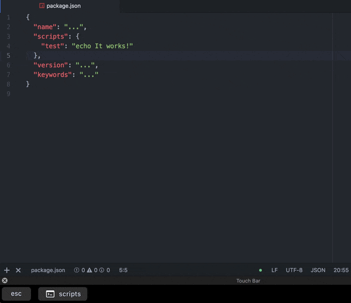
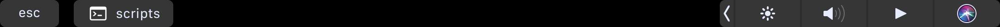

<!-- References -->
[touchbar-link]: https://bit.ly/2lFekix
[platformio-link]: https://bit.ly/2tFvYGQ

# Touchbar-Run

An atom package to run package.json scripts straight from the MacBook Touch Bar.



## Installation

Install with apm: `$ apm install touchbar-run`

You can also install through the settings view by searching for `touchbar-run` under the install tab.

---

To make sure it's working, add some scripts to your package.json
```json
{
  "name": "...",
  "version": "...",

  "scripts": {
    "test": "echo It works!"
  },

  "keywords": "..."
}
```
And just like that, the button should appear



## Built With

* [touchbar-registry][touchbar-link] - The TouchBar package used
* [platformio-ide-terminal][platformio-link] - The terminal

## Contributing

Please read [CONTRIBUTING.md](CONTRIBUTING.md) for details on our code of conduct, and the process for submitting pull requests to us.

## Versioning

We use [SemVer](http://semver.org/) for versioning. For the versions available, see the [tags on this repository](https://bit.ly/2KpIcdy).

## Authors

* **jdtzmn** - *Initial work*

See also the list of [contributors](https://bit.ly/2tCWgJu) who participated in this project.

## Acknowledgments

* [@haklop](https://bit.ly/2Kb7m3G) for creating the [touchbar-registry][touchbar-link] package.
* [@platformio](https://bit.ly/2N1Ux9F) for creating the [platformio-ide-terminal][platformio-link] package.
* [Icons8.com](https://Icons8.com) for the terminal icon.
* You, for realizing how awesome this package is and deciding to star it.

## License

This project is licensed under the MIT License - see the [LICENSE.md](LICENSE.md) file for details
